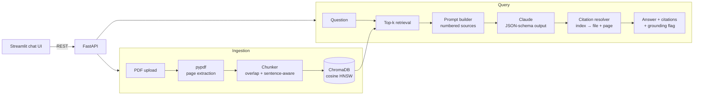

# 📄 RAG Document Assistant

[](https://github.com/Rustam751/rag-document-assistant/actions/workflows/ci.yml)


A production-grade **Retrieval-Augmented Generation (RAG)** assistant for medical, legal, and academic PDFs. Upload documents, ask questions, and get answers that are **grounded in cited sources** — every claim links back to a file, page number, and verbatim quote, and the model explicitly abstains when the documents don't contain the answer.

<!-- TODO: replace with a real demo GIF: docs/demo.gif -->


## Why this exists

Domain documents (clinical guidelines, contracts, papers) are long, dense, and dangerous to summarize from memory — an LLM answering from its own knowledge can hallucinate a dosage or a contract clause. This project constrains the model to answer **only** from retrieved document excerpts and to prove it with citations, making answers auditable.

## Architecture



**Key design decisions**

| Decision | Rationale |
|---|---|
| Embeddings run locally (Chroma's ONNX all-MiniLM-L6-v2) | No embedding API cost, works offline, deterministic ingestion |
| LLM output is JSON-schema constrained (`output_config.format`) | Structured `{answer, citations[]}` — no fragile regex parsing of citations |
| Citations resolved server-side (index → file, page, quote) | The model can only cite excerpts it was actually shown |
| `grounded: false` flag when the model abstains or returns no citations | The UI can visibly warn instead of presenting a guess as fact |
| Injectable embedding function + LLM client | Tests run fully offline: no API key, no model downloads |

## Tech stack

**Python 3.12** · FastAPI · ChromaDB · Anthropic Claude (`claude-opus-4-8`, adaptive thinking + structured outputs) · pypdf · Streamlit · pytest · Ruff · Docker · GitHub Actions

## Quickstart

```bash
git clone https://github.com/Rustam751/rag-document-assistant
cd rag-document-assistant

python -m venv .venv && source .venv/bin/activate   # Windows: .venv\Scripts\activate
pip install -e .[ui,dev]

cp .env.example .env         # add your ANTHROPIC_API_KEY

# Terminal 1 — API
uvicorn rag_assistant.api:app --reload --port 8000

# Terminal 2 — UI
streamlit run app/streamlit_app.py
```

Open http://localhost:8501, upload a PDF in the sidebar, and start asking questions. Interactive API docs are at http://localhost:8000/docs.

> The first ingestion downloads Chroma's small ONNX embedding model (~80 MB) once.

### Docker

```bash
ANTHROPIC_API_KEY=sk-ant-... docker compose up --build
# UI on :8501, API on :8000, data persisted in a named volume
```

## API

| Method | Endpoint | Description |
|---|---|---|
| `GET` | `/health` | Liveness check |
| `POST` | `/documents` | Upload + ingest a PDF (multipart `file`) |
| `GET` | `/documents` | List ingested documents and chunk counts |
| `DELETE` | `/documents/{source}` | Remove a document from the index |
| `POST` | `/ask` | `{"question": "...", "top_k": 5}` → grounded answer |

Example response from `/ask`:

```json
{
  "question": "What is the recommended adult dose?",
  "answer": "The guideline recommends 500 mg twice daily for adults.",
  "grounded": true,
  "citations": [
    {"source_index": 1, "quote": "500 mg twice daily", "source": "guideline.pdf", "page": 12}
  ],
  "retrieved": [
    {"source": "guideline.pdf", "page": 12, "score": 0.83, "text": "..."}
  ]
}
```

## Hallucination guard

Three layers keep answers honest:

1. **Prompt contract** — the system prompt forbids outside knowledge and requires a per-claim citation.
2. **Schema-constrained output** — the model must return `{answer, citations: [{source, quote}]}`; free-form prose can't slip through unstructured.
3. **Server-side resolution** — citation indices are mapped back to the exact retrieved chunks; an answer with no valid citations is flagged `grounded: false` and the UI shows a warning.

## Evaluation

The repo ships an evaluation harness (`eval/run_eval.py`) that measures:

- **Retrieval hit rate** — is the expected source/page in the top-k results?
- **Answer keyword coverage** — does the answer contain the expected facts?
- **Abstention rate** — does the model correctly refuse unanswerable questions instead of hallucinating?
- **Latency** per question.

```bash
# 1. Ingest your PDFs, 2. fill eval/questions.json (~20 questions incl. unanswerable ones), then:
python eval/run_eval.py
```

Results are printed as a summary and written to `eval/results.json`.

### Results (20 questions over a 70-page engineering report; 15 answerable + 5 unanswerable)

| Metric | Score |
|---|---|
| Retrieval hit rate (answerable questions) | **0.87** (13/15) |
| Abstention rate on unanswerable questions | **1.00** (5/5) |
| Mean answer keyword coverage | 0.86 |
| Fabricated facts across all 20 answers | **0** |
| Mean latency | 4.1 s |

Retrieval was verified to be fully deterministic across repeated runs (identical top-k both times); answer phrasing varies slightly between runs, which is why the eval separates retrieval metrics from answer metrics. Two of the initially-measured retrieval "misses" turned out to be off-by-one page labels in the question set (PDF cover-page offset), confirmed with the inspection tool below.

The two remaining failures were as informative as the passes:

- **Zero hallucinations** — every wrong outcome was a *false refusal* ("the documents don't contain this"), never an invented fact. That's the guard working as designed.
- **One recall miss (chunk dilution):** the queried fact exists in exactly one chunk, but that chunk opens with an unrelated summary paragraph that dominates its embedding — it ranks #11 for the question that needs it. Raising k helps neighbors but not this; the principled fix is hybrid lexical+dense retrieval (the fact-bearing sentence matches the query terms verbatim).
- **One relevance miss:** a "describe the optical path" question retrieved a verbose *background* passage describing an alternative setup the report explicitly didn't use, and the model answered confidently from it — with valid citations. Cosine similarity rewarded the elaborately-worded background over the terse passage describing what was actually built. Lesson: **grounded means "not fabricated," not "the right passage."** Hybrid retrieval + reranking is the planned fix (see Roadmap).

### Debugging retrieval

```bash
python eval/inspect_retrieval.py "your question" --k 10   # see what would be retrieved, with scores
python eval/inspect_retrieval.py --grep "25x25"           # find which stored chunks contain a fact
```

## Testing & CI

```bash
pytest        # 27 offline tests: chunking, vector store, LLM contract, API
ruff check src tests app eval
```

Tests inject a deterministic embedding function and a fake LLM client, so the suite runs **without an API key and without downloading models** — the same suite runs in GitHub Actions on every push.

## Project structure

```
├── src/rag_assistant/
│   ├── config.py        # env-driven settings
│   ├── ingestion.py     # PDF extraction + sentence-aware overlapping chunking
│   ├── vectorstore.py   # ChromaDB wrapper (cosine, injectable embeddings)
│   ├── llm.py           # grounded answering: prompt, JSON schema, citation resolution
│   ├── pipeline.py      # ingest → retrieve → answer orchestration
│   └── api.py           # FastAPI endpoints
├── app/streamlit_app.py # chat UI with citation expanders
├── eval/                # evaluation harness + question set
├── tests/               # offline unit + API tests
├── Dockerfile · docker-compose.yml · Makefile · .github/workflows/ci.yml
```

## Limitations

- **Scanned PDFs are rejected** — there is no OCR step; run OCR (e.g. `ocrmypdf`) first.
- **Character-based chunking** — a token-aware or layout-aware chunker (tables, headers) would improve retrieval on structured documents.
- **Quotes are model-generated** — citations point to real retrieved chunks, but the verbatim quote is not string-verified against the chunk (a natural next step).
- Single-collection index — no per-user isolation or auth; this is a demo deployment, not a multi-tenant service.

## Roadmap

- [ ] Verbatim quote verification (string-match citations against chunks)
- [ ] Hybrid retrieval (BM25 + dense) with reranking
- [ ] OCR fallback for scanned documents
- [ ] Streaming answers over SSE
- [ ] LLM-as-judge scoring in the eval harness

## License

MIT — see [LICENSE](LICENSE).
